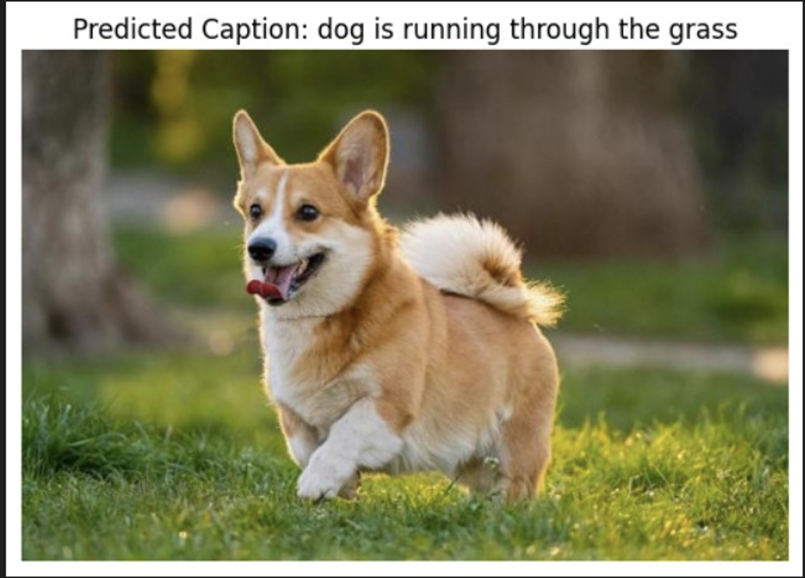
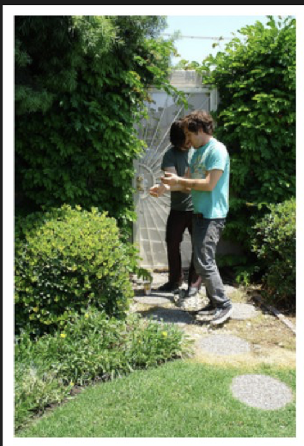
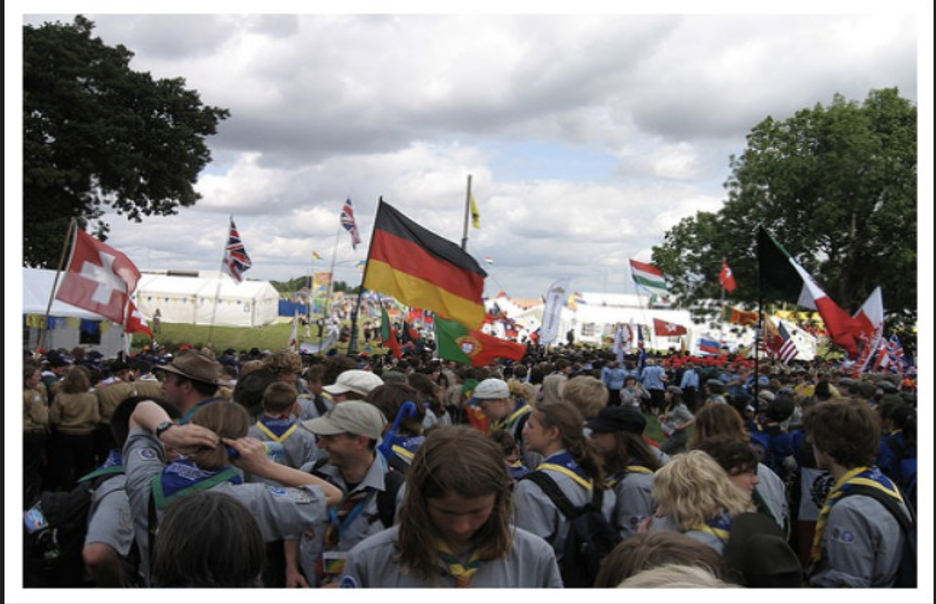

# AI Image Captioning System

An end-to-end deep learning project for automatically generating natural-language captions for images. The project explores multiple neural network architectures for combining visual image features with sequential text representations and compares their performance using BLEU scores.

## Overview

Image captioning combines two major areas of deep learning:

- **Computer Vision** for understanding image content
- **Natural Language Processing** for generating descriptive text

The system extracts visual features from images using pretrained convolutional neural networks and combines those features with sequence-based neural networks that generate captions word by word.

Multiple architectures were explored, including:

- LSTM
- GRU
- Transformer
- Convolutional-Bidirectional LSTM

The final Convolutional-Bidirectional model achieved the strongest BLEU performance among the final recurrent-model experiments.

---

## Architecture

The image-captioning pipeline consists of:

1. Image preprocessing
2. CNN-based feature extraction
3. Caption cleaning and tokenization
4. Sequence generation
5. Image and text feature fusion
6. Neural network training
7. Caption generation
8. BLEU-based evaluation

### Visual Feature Extraction

Pretrained CNN architectures were used to transform images into compact visual feature vectors.

Experiments included:

- ResNet-50 with MS COCO
- InceptionV3 with Flickr30k

The final training pipeline uses pre-extracted image features for efficient model training.

### Caption Processing

Captions are cleaned and prepared by:

- converting text to lowercase
- removing digits and special characters
- removing unnecessary whitespace
- adding `startseq` and `endseq` tokens
- tokenizing captions into integer sequences
- padding sequences to a consistent length

---

## Models

### LSTM

The LSTM architecture combines CNN image features with embedded caption sequences and learns temporal relationships between words.

Training loss decreased from:

```text
4.9723 → 2.9810
```

BLEU scores:

```text
BLEU-1: 0.4428
BLEU-2: 0.2380
```

### GRU

A GRU-based sequence decoder was evaluated as a computationally lighter alternative to LSTM.

Training loss decreased from:

```text
4.7969 → 2.9385
```

BLEU scores:

```text
BLEU-1: 0.4282
BLEU-2: 0.2317
```

### Transformer

A Transformer-based captioning architecture was also evaluated during the Flickr30k experiments.

Best observed:

```text
BLEU-4: 0.323
```

### Convolutional-Bidirectional Model

The final architecture combines CNN image features with a bidirectional recurrent text encoder.

The image branch processes visual features using dropout and dense layers, while the caption branch uses:

- word embeddings
- dropout
- bidirectional LSTM layers
- dense layers
- softmax prediction

Training loss decreased from:

```text
5.1389 → 3.4807
```

BLEU scores:

```text
BLEU-1: 0.4496
BLEU-2: 0.2438
```

---

## Model Comparison

| Model | BLEU-1 | BLEU-2 |
|---|---:|---:|
| LSTM | 0.4428 | 0.2380 |
| GRU | 0.4282 | 0.2317 |
| Convolutional-Bidirectional | **0.4496** | **0.2438** |

The Convolutional-Bidirectional architecture produced the strongest BLEU-1 and BLEU-2 results among the final recurrent-model experiments.

The Transformer experiment was evaluated separately using BLEU-4 and achieved:

```text
BLEU-4: 0.323
```

---

## Sample Predictions

Below are example captions generated by the trained image captioning model.

### External Image Example



**Generated caption:**

```text
dog is running through the grass
```

### Garden Scene



**Generated caption:**

```text
man in blue shirt and jeans is walking down the street
```

### Seesaw Scene


**Generated caption:**

```text
two men are playing in the sand
```

### Crowd Scene



**Generated caption:**

```text
crowd of people are gathered around the crowd
```

These examples demonstrate both successful caption generation and limitations when the model encounters more complex visual scenes.

---

## Repository Structure

```text
image-captioning-deep-learning/
│
├── notebooks/
│   ├── 01_data_preprocessing.ipynb
│   ├── 02_model_training_comparison.ipynb
│   └── 03_final_image_captioning.ipynb
│
├── models/
│   └── conv_bidirectional.h5
│
├── docs/
│   └── AI_Image_Captioning_System_Report.pdf
│
├── samples/
│   ├── dog_caption_example.png
│   ├── garden_prediction.png
│   ├── seesaw_prediction.png
│   └── crowd_prediction.png
│
├── requirements.txt
├── .gitattributes
├── .gitignore
└── README.md
```

---

## Dataset

The project initially explored the **MS COCO** image-caption dataset.

Due to the large storage and memory requirements of the full MS COCO training dataset, later experiments were performed using **Flickr30k**.

Flickr30k provides multiple human-written captions for each image and is commonly used for training and evaluating image-captioning systems.

The final workflow uses pre-extracted image features stored locally during training.

The large feature file is intentionally excluded from this repository because of its size and can be regenerated through the preprocessing workflow documented in the notebooks.

---

## Technologies

- Python
- TensorFlow
- Keras
- NumPy
- Pandas
- NLTK
- Pillow
- Matplotlib
- Scikit-learn
- Jupyter Notebook
- CNN
- LSTM
- GRU
- Bidirectional LSTM
- Transformer
- InceptionV3
- ResNet-50

---

## Installation

Clone the repository:

```bash
git clone https://github.com/Rishika73/image-captioning-deep-learning.git
cd image-captioning-deep-learning
```

Install the required Python libraries:

```bash
pip install -r requirements.txt
```

---

## Project Workflow

The notebooks document the model-development process from preprocessing through evaluation.

### 1. Data Preprocessing

```text
notebooks/01_data_preprocessing.ipynb
```

Covers:

- dataset preparation
- caption cleaning
- tokenization
- sequence preparation
- image feature extraction and preprocessing

### 2. Model Training and Comparison

```text
notebooks/02_model_training_comparison.ipynb
```

Contains experiments with multiple neural-network architectures, model training, hyperparameter exploration, and performance comparison.

### 3. Final Image Captioning Model

```text
notebooks/03_final_image_captioning.ipynb
```

Contains the final Convolutional-Bidirectional architecture, model training, BLEU evaluation, and caption-generation workflow.

---

## Trained Model

The trained Convolutional-Bidirectional model is stored in:

```text
models/conv_bidirectional.h5
```

Because the model file is large, it is managed using **Git LFS**.

After cloning the repository, initialize Git LFS and download the model with:

```bash
git lfs install
git lfs pull
```

---

## Large Feature File

The preprocessing workflow creates a large pre-extracted feature file:

```text
features.pkl
```

This file is approximately 500 MB and is intentionally excluded from the GitHub repository to keep the project lightweight.

It contains pre-extracted image features used during model training and can be regenerated using the preprocessing workflow in the notebooks.

---

## Evaluation

Model performance is evaluated using BLEU scores through NLTK.

BLEU measures the overlap between generated captions and human-written reference captions.

- **BLEU-1** evaluates individual word overlap
- **BLEU-2** evaluates two-word sequence overlap
- **BLEU-4** was additionally used during Transformer experiments

The final Convolutional-Bidirectional model achieved:

```text
BLEU-1: 0.4496
BLEU-2: 0.2438
```

---

## Key Takeaways

This project demonstrates:

- image feature extraction using pretrained CNNs
- natural-language sequence preprocessing
- multimodal image and text feature fusion
- recurrent neural-network architectures
- bidirectional sequence modeling
- Transformer experimentation
- neural-network training and evaluation
- BLEU-based caption quality comparison
- management of large trained model artifacts using Git LFS

---

## Future Improvements

Potential extensions include:

- attention-based caption generation
- Vision Transformer image encoders
- Transformer-based caption decoders
- beam-search decoding
- larger image-caption datasets
- pretrained vision-language models
- improved semantic evaluation metrics
- interactive image-upload inference application

---

## Project Report

A detailed explanation of the architecture, experiments, training process, model comparison, and results is available in:

```text
docs/AI_Image_Captioning_System_Report.pdf
```
