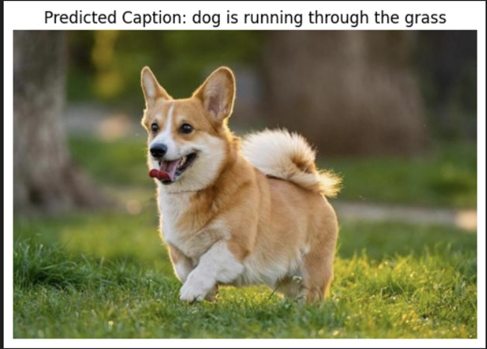
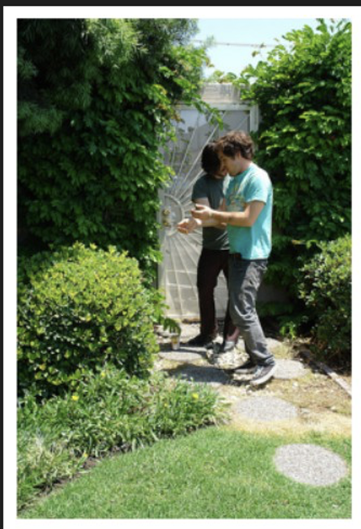
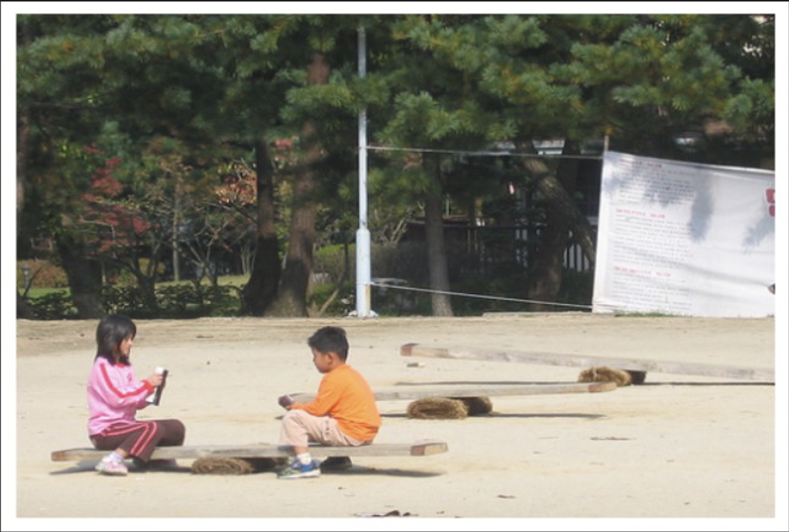
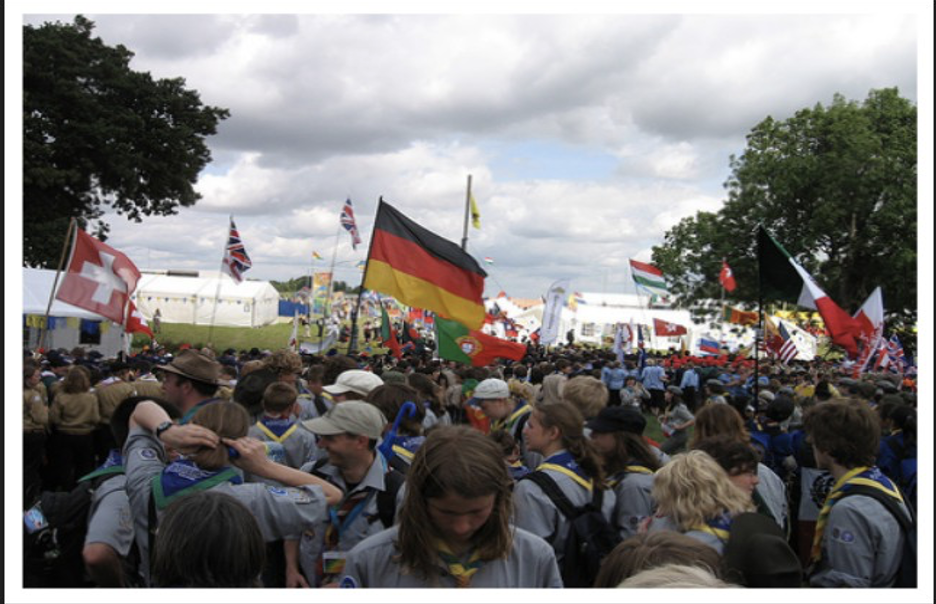

# AI Image Captioning System

An end-to-end deep learning project for generating natural-language captions from images.

The project combines pretrained CNN-based visual feature extraction with multiple sequence models, including LSTM, GRU, Bidirectional LSTM, and Transformer-based approaches, and compares model performance using BLEU evaluation.

---

## Project Overview

Image captioning combines:

- Computer Vision for understanding image content
- Natural Language Processing for generating descriptive text

The workflow extracts visual features from images, processes caption sequences, fuses image and text representations, trains multiple neural-network architectures, and evaluates generated captions against human-written references.

The strongest recurrent-model results were produced by the Convolutional-Bidirectional architecture.

---

## Model Comparison

| Model | BLEU-1 | BLEU-2 |
|---|---:|---:|
| LSTM | 0.4428 | 0.2380 |
| GRU | 0.4282 | 0.2317 |
| Convolutional-Bidirectional | **0.4496** | **0.2438** |

Transformer experiments were evaluated separately and achieved:

```text
BLEU-4: 0.323
```

The Convolutional-Bidirectional model produced the strongest BLEU-1 and BLEU-2 scores among the final recurrent-model experiments.

---

## Architecture

```text
Input Image
    |
    v
Image Preprocessing
    |
    v
Pretrained CNN
    |
    v
Visual Feature Vector
    |
    +----------------------+
    |                      |
    v                      v
Caption Cleaning      Caption Tokenization
                           |
                           v
                    Sequence Preparation
                           |
                           v
                 Text Representation Model
                           |
                           v
                Image + Text Feature Fusion
                           |
                           v
                  Caption Prediction
                           |
                           v
                    Generated Caption
                           |
                           v
                     BLEU Evaluation
```

The pipeline combines visual image features with sequential text representations to predict captions word by word.

---

## Visual Feature Extraction

Pretrained CNN architectures are used to transform images into compact feature vectors.

Experiments include:

- ResNet-50 with MS COCO
- InceptionV3 with Flickr30k

The final training workflow uses pre-extracted image features to reduce repeated CNN computation during model training.

---

## Caption Processing

Caption preprocessing includes:

- Lowercasing text
- Removing digits and special characters
- Removing unnecessary whitespace
- Adding `startseq` and `endseq` tokens
- Tokenizing captions into integer sequences
- Padding sequences to a consistent length

These processed sequences are used as decoder inputs during training.

---

## Model Architectures

### LSTM

The LSTM model combines image features with embedded caption sequences and learns temporal relationships between words.

Training loss:

```text
4.9723 → 2.9810
```

BLEU results:

```text
BLEU-1: 0.4428
BLEU-2: 0.2380
```

---

### GRU

The GRU model provides a lighter recurrent alternative to LSTM.

Training loss:

```text
4.7969 → 2.9385
```

BLEU results:

```text
BLEU-1: 0.4282
BLEU-2: 0.2317
```

---

### Transformer

A Transformer-based captioning architecture was also evaluated during the Flickr30k experiments.

Best observed result:

```text
BLEU-4: 0.323
```

---

### Convolutional-Bidirectional Model

The final recurrent architecture combines CNN image features with a bidirectional text encoder.

The image branch uses:

- Pre-extracted CNN features
- Dropout
- Dense layers

The caption branch uses:

- Word embeddings
- Dropout
- Bidirectional LSTM layers
- Dense layers
- Softmax output

Training loss:

```text
5.1389 → 3.4807
```

BLEU results:

```text
BLEU-1: 0.4496
BLEU-2: 0.2438
```

This model produced the strongest BLEU-1 and BLEU-2 scores among the final recurrent experiments.

---

## Sample Predictions

### External Image Example



Generated caption:

```text
dog is running through the grass
```

---

### Garden Scene



Generated caption:

```text
man in blue shirt and jeans is walking down the street
```

---

### Seesaw Scene



Generated caption:

```text
two men are playing in the sand
```

---

### Crowd Scene



Generated caption:

```text
crowd of people are gathered around the crowd
```

These examples show both successful caption generation and the limitations of the model on more complex visual scenes.

---

## Dataset

The project initially explored the MS COCO image-caption dataset.

Because of the storage and memory requirements of the full MS COCO training dataset, later experiments were performed using Flickr30k.

Flickr30k provides multiple human-written captions for each image and is commonly used for image-captioning research.

The final workflow uses pre-extracted image features stored locally during training.

---

## Evaluation

Model performance is measured using BLEU scores through NLTK.

BLEU evaluates overlap between generated captions and reference captions.

- BLEU-1 measures individual word overlap
- BLEU-2 measures two-word sequence overlap
- BLEU-4 was used during Transformer experiments

Final Convolutional-Bidirectional results:

```text
BLEU-1: 0.4496
BLEU-2: 0.2438
```

---

## Project Workflow

### 1. Data Preprocessing

```text
notebooks/01_data_preprocessing.ipynb
```

Covers:

- Dataset preparation
- Caption cleaning
- Tokenization
- Sequence preparation
- Image feature extraction

---

### 2. Model Training and Comparison

```text
notebooks/02_model_training_comparison.ipynb
```

Covers:

- LSTM experiments
- GRU experiments
- Transformer experiments
- Hyperparameter exploration
- Model comparison

---

### 3. Final Image Captioning Model

```text
notebooks/03_final_image_captioning.ipynb
```

Contains:

- Final Convolutional-Bidirectional architecture
- Training workflow
- BLEU evaluation
- Caption-generation pipeline

---

## Trained Model

The trained model is stored in:

```text
models/conv_bidirectional.h5
```

The model file is managed through Git LFS.

After cloning:

```bash
git lfs install
git lfs pull
```

---

## Large Feature File

The preprocessing workflow creates:

```text
features.pkl
```

This file is approximately 500 MB and is intentionally excluded from the repository.

It contains pre-extracted image features used during training and can be regenerated from the preprocessing notebook.

---

## Tech Stack

### Deep Learning
- TensorFlow
- Keras
- CNN
- LSTM
- GRU
- Bidirectional LSTM
- Transformer

### Computer Vision
- InceptionV3
- ResNet-50

### Data & Evaluation
- NumPy
- Pandas
- NLTK
- Scikit-learn
- Matplotlib
- Pillow

### Development
- Python
- Jupyter Notebook
- Git LFS

---

## Repository Structure

```text
image-captioning-deep-learning/
├── notebooks/
│   ├── 01_data_preprocessing.ipynb
│   ├── 02_model_training_comparison.ipynb
│   └── 03_final_image_captioning.ipynb
├── models/
│   └── conv_bidirectional.h5
├── docs/
│   └── AI_Image_Captioning_System_Report.pdf
├── samples/
│   ├── dog_caption_example.png
│   ├── garden_prediction.png
│   ├── seesaw_prediction.png
│   └── crowd_prediction.png
├── requirements.txt
├── .gitattributes
├── .gitignore
└── README.md
```

---

## Installation

Clone the repository:

```bash
git clone https://github.com/Rishika73/image-captioning-deep-learning.git
cd image-captioning-deep-learning
```

Install dependencies:

```bash
pip install -r requirements.txt
```

---

## Engineering Highlights

This project demonstrates:

- Pretrained CNN feature extraction
- Natural-language sequence preprocessing
- Multimodal image and text feature fusion
- LSTM and GRU sequence modeling
- Bidirectional recurrent architectures
- Transformer experimentation
- Neural-network training and comparison
- BLEU-based caption evaluation
- Sample inference on unseen images
- Large model artifact management with Git LFS

---

## Future Improvements

- Attention-based caption generation
- Vision Transformer image encoders
- Transformer-based caption decoders
- Beam-search decoding
- Larger image-caption datasets
- Pretrained vision-language models
- Improved semantic evaluation metrics
- Interactive image-upload inference application

---

## Project Report

A detailed explanation of the experiments, architecture, training process, and results is available at:

```text
docs/AI_Image_Captioning_System_Report.pdf
```
